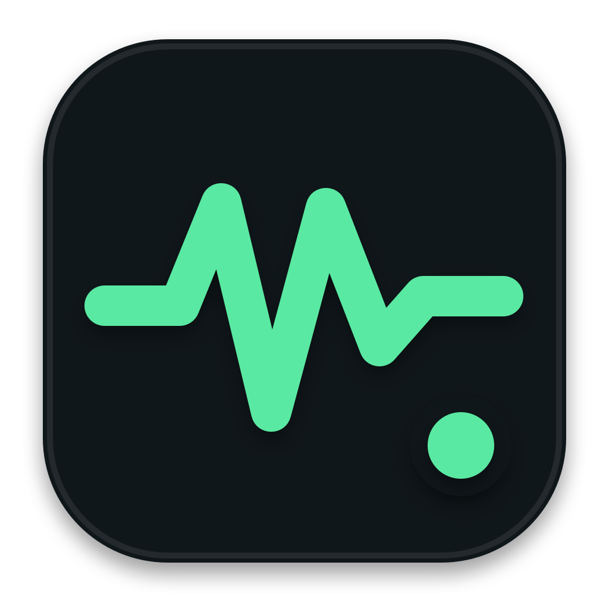

<p align="center">
  
</p>

# Input Status

一个轻量的 macOS 桌面挂件，用于查看 [AI.INPUT.IM](https://status.input.im/) 的服务可用状态。它提供原生玻璃界面、菜单栏入口、约两分钟自动刷新和手动刷新。普通用户可直接通过 DMG 安装，不需要 Xcode、Command Line Tools 或 Apple Developer 账号。

## 功能

- 桌面挂件直接显示服务在线状态与可用率。
- macOS 26 使用原生 Liquid Glass，macOS 14/15 使用半透明材质回退。
- 支持锁定挂件位置，避免误拖动；解锁后可移动并自动保存位置。
- 约每两分钟自动刷新，右上角按钮可立即刷新。
- 显示每项服务的可用率和最近响应耗时。
- 可选状态变化通知，仅在服务异常或恢复时发送 macOS 通知。
- 菜单栏同步显示状态，并可显示或隐藏桌面挂件。
- 网络异常时保留最近一次成功数据，超过约四分钟会标记为过期。
- 每小时自动检查 GitHub Release，在后台下载并安全安装签名更新。
- 菜单栏提供“检查更新…”，可随时手动检查。
- 从“应用程序”首次启动后，自动请求注册为登录项。
- 保留 WidgetKit 扩展，可在系统允许时添加原生小组件。

## 系统要求

- macOS 14 Sonoma 或更高版本。
- Apple Silicon 或 Intel Mac。

## 安装

### DMG 安装（推荐）

1. 从 [GitHub Releases](https://github.com/Houtx/Project-Input-Status/releases/latest) 下载最新的 `InputStatus-*-universal.dmg`。
2. 打开 DMG，将 `InputStatus` 拖入“应用程序”。
3. 在“应用程序”中打开 `InputStatus`。

DMG 是 Universal 2 版本，同时支持 Apple Silicon 和 Intel Mac，不需要安装任何开发工具。

由于当前发行版本未使用 Apple Developer ID 公证，macOS 首次打开时可能提示无法验证开发者。这时请：

1. 关闭该提示。
2. 打开“系统设置 → 隐私与安全性”。
3. 在安全性区域找到 InputStatus，点击“仍要打开”。
4. 在再次出现的确认框中点击“打开”。

此确认通常只需操作一次。

从 `1.5.0` 开始，后续正式版本可在应用内自动更新，无需重复下载 DMG。

### 从源码安装（开发者）

此方式需要 macOS Command Line Tools，但不需要完整 Xcode。如果尚未安装，可运行 `xcode-select --install`。

```zsh
git clone https://github.com/Houtx/Project-Input-Status.git
cd Project-Input-Status
./scripts/install.sh
```

源码安装脚本会：

1. 使用当前系统 SDK 编译主程序和 Widget 扩展。
2. 使用 ad-hoc 签名生成本机可运行的应用。
3. 安装到 `/Applications/InputStatus.app`。
4. 注册 Widget 扩展并配置登录启动。
5. 启动桌面挂件和菜单栏应用。

## 使用

- 点击锁形图标切换位置锁定。默认锁定，锁定时无法拖动。
- 点击刷新图标立即请求最新状态。
- 点击“打开状态页”查看完整状态页。
- 点击菜单栏状态图标，可显示或隐藏桌面挂件。
- 在菜单栏开启“状态变化通知”，首次开启时允许 macOS 通知权限。
- 点击菜单栏中的“检查更新…”立即检查 GitHub 最新版本。
- 挂件解锁后可以拖动，位置会在下次启动时恢复。

更新由 [Sparkle](https://sparkle-project.org/) 完成。应用每小时检查一次，默认后台下载；如果应用长时间未退出，会提示重启以完成安装。

## WidgetKit 说明

项目包含标准 WidgetKit 扩展，可在桌面空白处右键选择“编辑小组件”，然后搜索“AI.INPUT.IM 服务状态”。

本项目使用本机 ad-hoc 签名，不同 macOS 版本可能不会在系统小组件图库中展示该扩展。应用内置的桌面挂件不受此限制，也是无 Xcode 环境下的默认实现。

## 隐私

- 不需要登录或填写 API Key。
- 不包含遥测、广告或用户追踪。
- 向 `https://status.input.im/api/status` 请求公开状态数据。
- 向 GitHub Releases 请求签名更新源，有新版本时下载 DMG。
- 状态缓存和挂件偏好仅保存在本机应用沙箱中。
- 通知由 macOS 在本机生成，不会向其他服务发送状态记录。

## 开发

仅构建、不安装：

```zsh
./scripts/build.sh
```

构建产物位于 `build/InputStatus.app`。
首次构建会下载固定版本的 Sparkle 2，校验 SHA-256 后缓存到 `build/dependencies/`。

运行核心数据测试和脚本/配置检查：

```zsh
./scripts/test.sh
```

测试和正式构建都只使用 Command Line Tools，不要求安装完整 Xcode。GitHub Pull Request 也会自动运行同样的测试并构建 Universal 2 应用。

生成 Universal 2 DMG 发行包：

```zsh
brew install create-dmg
./scripts/create-dmg.sh
```

DMG、SHA-256 校验文件和已签名的 `appcast.xml` 位于 `dist/`。版本更新说明位于 `release-notes/`。

Sparkle 更新签名私钥保存在本机钥匙串的 `com.inputstatus.desktop` 账户中，公开仓库只包含公钥。GitHub 仓库配置加密 Secret `SPARKLE_PRIVATE_KEY` 后，每次发布正式 Release 都会自动签名并上传 `appcast.xml`。

重新生成应用图标：

```zsh
./scripts/generate-icon.sh
```

工程结构：

- `InputStatus/App`：桌面挂件、菜单栏应用和周期刷新。
- `InputStatus/Widget`：WidgetKit 扩展。
- `InputStatus/Shared`：状态 API、数据模型和本地缓存。
- `InputStatus/Resources`：图标、Info.plist 和沙箱权限。
- `scripts`：无 Xcode 的构建、安装、更新源生成和卸载脚本。
- `InputStatus.xcodeproj`、`project.yml`：可选的 Xcode/XcodeGen 工程描述。

## 卸载

```zsh
./scripts/uninstall.sh
```

卸载会删除 `/Applications/InputStatus.app`、注销 Widget 扩展并移除登录启动项，不会删除项目源码。

## 签名说明

当前 DMG 和默认构建采用 ad-hoc 签名，未经 Apple 公证，因此首次打开需要按上方步骤在“隐私与安全性”中确认。后续应用内更新还会使用独立的 Ed25519 签名验证完整性和来源。这不会要求用户安装开发工具。
